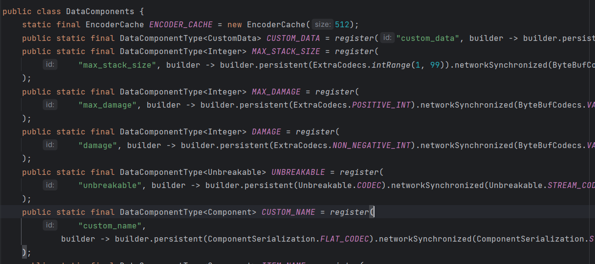

# NMS层面的Component与nbt

在获取到 `NMS ItemStack` 实例之后，我们就可以在这个层面进行操作了

反编译 `net.minecraft.world.item.ItemStack`，我们可以找到这几个方法：

```java
// ItemStack.class
public <T> T set(DataComponentType<? super T> type, @Nullable T value)
public <T> T remove(DataComponentType<? extends T> type)
```

好嘛，增删都有了，那么改和查呢？

`ItemStack` 实现了 接口 `DataComponentHolder`，也应该包含它的方法

```java
// DataComponentHolder.class
default <T> T get(DataComponentType<? extends T> type)
default boolean has(DataComponentType<?> type)
```

现在我们要搞明白 `DataComponentType` 是什么，双击 Shift 搜索这个 class：

<figure><figcaption></figcaption></figure>

好多东西，根本看不懂，也不会用。不过没关系，NMS 提供了一个类存储这个接口的实例：`net.minecraft.core.component.DataComponents`

<figure><figcaption><p>可以看到所有的组件都在这里了</p></figcaption></figure>

我们可以直接从这个类取出数据来实现增删改查的操作，举个例子：给玩家一个隐形展示框物品

```java
// 创建物品展示框的Bukkit ItemStack实例, 转换为NMS ItemStack
net.minecraft.world.item.ItemStack nmsIs = CraftItemStack.asNMSCopy(new ItemStack(Material.ITEM_FRAME));
// 取出以nbt格式保存的EntityData
CompoundTag tag = nmsIs.getOrDefault(DataComponents.ENTITY_DATA, CustomData.EMPTY).copyTag();
// 设置Entity id, 否则会报错
tag.putString("id", "minecraft:item_frame");
// 设为隐形
tag.putBoolean("Invisible", true);
// 更新物品的组件
nmsIs.set(DataComponents.ENTITY_DATA, CustomData.of(tag));
```

其它的 `DataComponentType` 可以在 `DataComponents` 类中找到，比如自定义的 nbt 就是 `CUSTOM_DATA` ，物品最大堆叠就是 `MAX_STACK_SIZE` 等


我们也可以通过序列化和反序列化转换物品和nbt：

```java
// nbt转换至Bukkit ItemStack
String tag = ...
// NMS ItemStack的方法asBukkitCopy调用了前文提到的CraftItemStack.asCraftMirror
// Tagparser.parseTag会报CommandSyntaxException, 不要忘记捕获或声明
try {
    org.bukkit.inventory.ItemStack bukkitIs = net.minecraft.world.item.ItemStack.parseOptional(MinecraftServer.getServer().registryAccess(), TagParser.parseTag(tag)).asBukkitCopy();
} catch (CommandSyntaxException e) {
    ...
}


// Bukkit ItemStack转换至nbt
org.bukkit.inventory.ItemStack bukkitIs = ...
String nbt = CraftItemStack.asNMSCopy(is).save(MinecraftServer.getServer().registryAccess()).toString();
```
